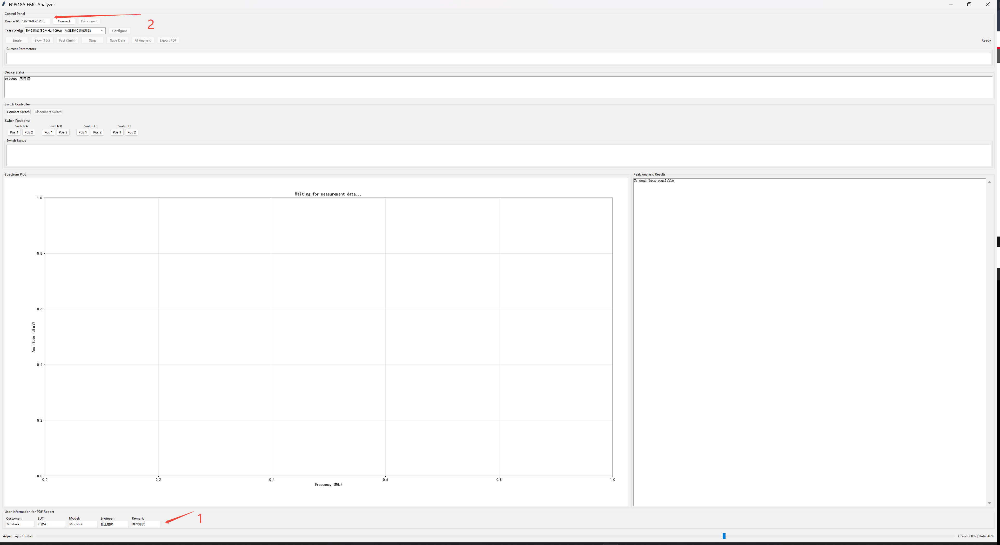
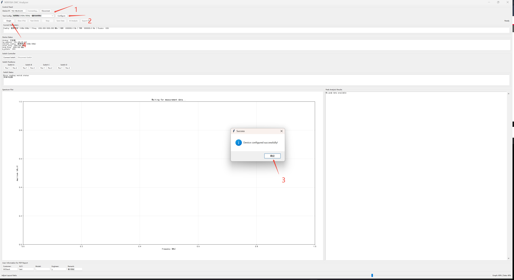
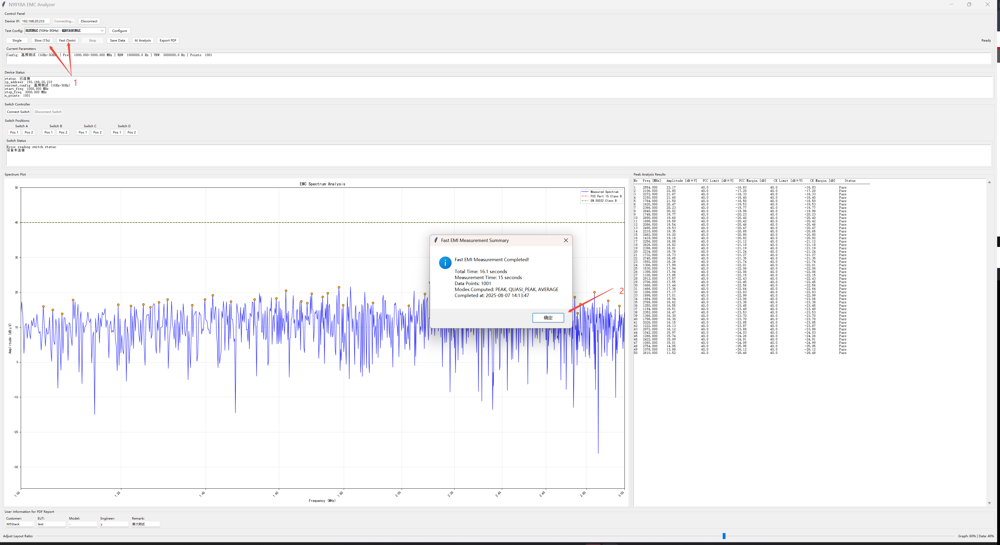
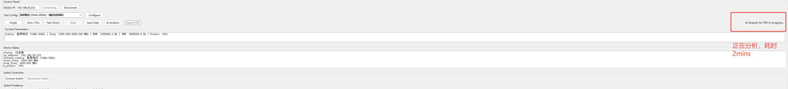
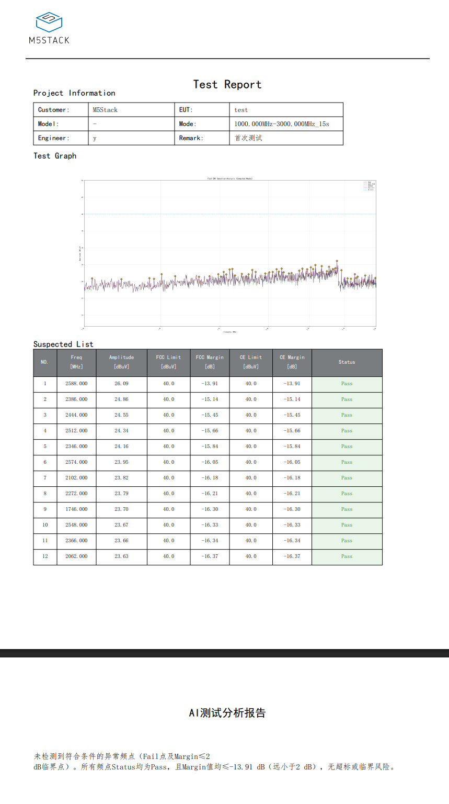

# N9918A-Controller

基于 N9918A 矢量网络分析仪的 EMC 测试前端界面，集成自动切换器控制和 AI 分析功能。

## 系统要求

- **操作系统**: Windows (目前仅支持 Windows 系统)
- **Python 版本**: 3.8 (推荐)
- **硬件设备**: 
  - N9918A 矢量网络分析仪
  - Mini-Circuits 切换器
  - USB 连接线

## 安装步骤

1. **克隆仓库**
   ```bash
   git clone https://github.com/yuyun2000/N9918A-Controller.git
   cd N9918A-Controller
   ```

2. **安装 Python 依赖**
   ```bash
   pip install -r requirements.txt
   ```

3. **连接硬件**
   - 将切换器通过 USB 连接至计算机
   - 确保 N9918A 设备网络连接正常

4. **运行程序**
   ```bash
   python n9918a_frontend.py
   ```

## 使用说明

### 1. 基本配置

#### 用户信息设置
在界面底部填写测试信息：
- **Customer**: 客户名称 (默认: M5Stack)
- **EUT**: 被测设备名称 (默认: 产品A)  
- **Model**: 产品型号 (默认: Model-X)
- **Engineer**: 测试工程师 (默认: 张工程师)
- **Remark**: 备注信息 (默认: 首次测试)

#### 设备连接
1. 在界面第一行 "Device IP" 输入框中填入设备 IP 地址 (默认: 192.168.20.233)
2. 点击 "Connect" 按钮连接设备
3. 等待连接成功提示

如图：

### 2. 测试配置

1. **选择测试配置**: 在 "Test Config" 下拉菜单中选择频率段配置 (共4个频率段可选)
2. **点击配置**: 点击 "Configure" 按钮应用配置
3. **自动切换**: 配置完成后，切换器会自动切换到对应位置，**无需手动操作**
4. **单次测量**: 点击 "Single" 按钮进行单次快速测量，会快速显示图像以验证无基本错误，之后才可以进行长时间测量


### 3. 测量操作


#### 15秒测量 (推荐)
- 点击 "Slow (15s)" 按钮
- 15秒内多次采样，计算平均值、峰值等多条曲线
- 支持后续 AI 分析和 PDF 导出

#### 5分钟测量
- 点击 "Fast (5min)" 按钮  
- 进行5分钟长时间测量
- 支持 AI 分析和 PDF 导出


### 4. 结果分析

#### AI 分析
- 点击 "AI Analysis" 按钮
- 耗时约 2 分钟，会弹出 AI 对测试结果的专业分析

#### PDF 报告导出
- **仅支持 15s 和 5min 测量模式**
- 点击 "Export PDF" 按钮
- 自动进行 AI 分析并生成完整测试报告
- 总耗时约 2 分钟
右上角会显示状态，如果发现有异常可以看日志

#### 数据保存
- 点击 "Save Data" 保存原始测量数据
- 一般情况下不需要使用此功能

最终生成的报告如下：

## 注意事项

1. **切换器控制**: 
   - 仓库中的 DLL 文件为切换器控制库，请勿删除
   - 切换器会根据选择的频率段自动切换，**禁止手动操作**

2. **网络配置**: 
   - 确保计算机与 N9918A 设备在同一网络段
   - 默认设备 IP 为 192.168.20.233

3. **测量模式**: 
   - 只有 15s 和 5min 模式支持 PDF 导出
   - AI 分析功能需要网络连接

4. **系统兼容性**: 
   - 目前仅支持 Windows 系统
   - 建议使用 Python 3.8 版本以确保最佳兼容性

## 文件结构

```
├── n9918a_frontend.py      # 主前端界面
├── n9918a_backend.py       # 后端控制逻辑
├── Switch.py               # 切换器控制模块
├── chat.py                 # AI 分析模块
├── requirements.txt        # Python 依赖包
├── *.dll                   # 切换器控制库 (Windows)
└── utils/
    └── create_pdf.py       # PDF 报告生成
```

## 故障排除

1. **切换器连接失败**: 检查 USB 连接，确认驱动安装正确
2. **设备连接超时**: 检查网络连接和 IP 地址设置
3. **AI 分析失败**: 检查网络连接，确认 API 访问正常
4. **PDF 导出错误**: 确保使用 15s 或 5min 测量模式

## 技术支持

如遇问题，请检查：
- Python 版本和依赖包安装
- 硬件连接状态
- 网络配置正确性

---

*建议在使用前仔细阅读本说明文档，确保正确配置和操作。*

